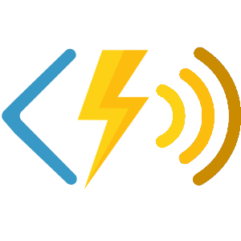
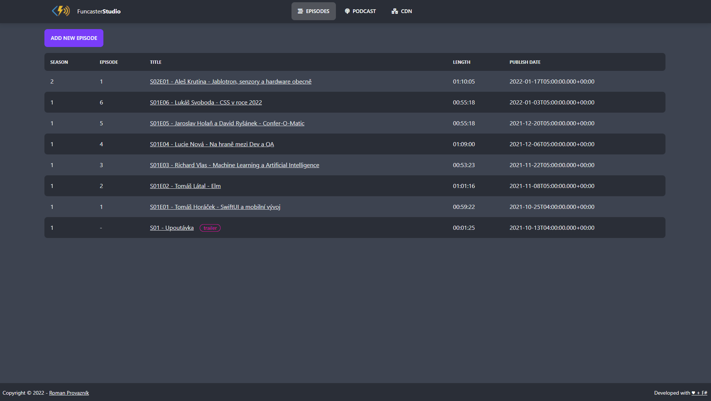

# FuncasterStudio

Free Docker-based solution for managing your 🔊 podcasts hosted with ⚡ [Funcaster](https://github.com/Dzoukr/Funcaster)!

## How does it work

1️⃣ Finish installation steps from ⚡ [Funcaster](https://github.com/Dzoukr/Funcaster) documentation and copy the storage account connection string.

2️⃣ Run `docker run -p 1234:80 -e PodcastStorage="<CONNECTION_STRING>" dzoukr/funcasterstudio`

3️⃣ Open `http://localhost:1234` and have fun with managing your awesome podcast!

